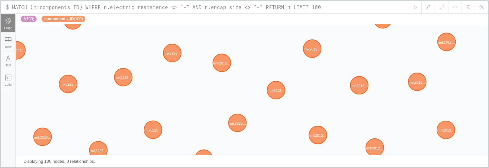
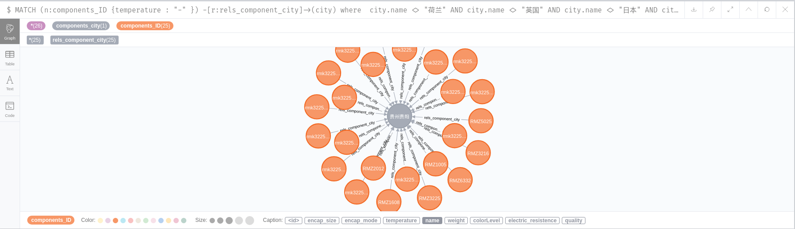
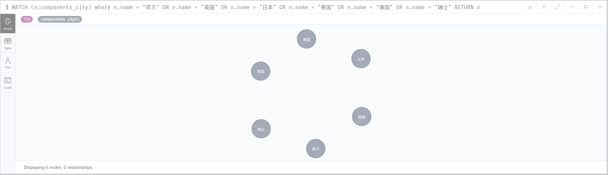
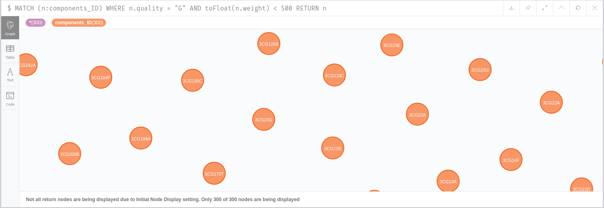

# Neo4j

## Plans
1. （熟悉python、neo3j、cypher、知识图谱相关知识，搭建实战开发环境，跑通示例程序。
	1. anaconda安装
	2. neo4j安装
2. （根据实际业务需求建立数据模型，将原始数据进行清洗后导入图数据库。建立数据模型，可以查询以下问题：
	1. 电阻值大于x，尺寸小于y的电阻有哪些？
	2. 温度范围在-40~120℃之间的国产振荡器有哪些？
	3. 对国产和进口器件进行分类；
	4. 质量等级为gjb级，质量小于500g的元器件有哪些？
3. 根据业务需求设计并实现智能搜索/智能问答系统，解决所有业务需求。


## 对于导入数据的代码的调整
1. 增加元器件其他的用于查询的属性 : 封装形式,质量等级,封装尺寸
1. 将数据结构中间的list修改为set : `rels_component_comCats` `components_cats` `rels_component_organization` `components_organizations` `rels_component_city` `components_city`.
防止不必要的数据冗余。

## Cypher 查询语句
1. 电阻值大于x，尺寸小于y的电阻有哪些？
```
MATCH (n:components_ID) WHERE  n.electric_resistence <> "-" AND n.encap_size <> "-" RETURN n LIMIT 100
```


2. 温度范围在-40~120℃之间的国产振荡器有哪些？
```
MATCH (n:components_ID {temperature : "-" })
-[r:rels_component_city]->(city) where 
city.name <> "荷兰" AND city.name <> "英国" AND city.name <> "日本" AND city.name <> "美国" AND city.name <> "德国" AND city.name <> "瑞士"
return city,n LIMIT 25
```



3. 对国产和进口器件进行分类；
```
MATCH (n:components_city) where n.name = "荷兰" OR n.name = "英国" OR n.name = "日本" OR n.name = "美国" OR n.name = "德国" OR n.name = "瑞士" RETURN n
MATCH (n:components_city) where n.name <> "荷兰" AND n.name <> "英国" AND n.name <> "日本" AND n.name <> "美国" AND n.name <> "德国" AND n.name <> "瑞士" RETURN n
```


4. 质量等级为gjb级，质量小于500g的元器件有哪些？
```
MATCH (n:components_ID) WHERE n.quality = "G" AND  toFloat(n.weight) < 500 RETURN n
```

