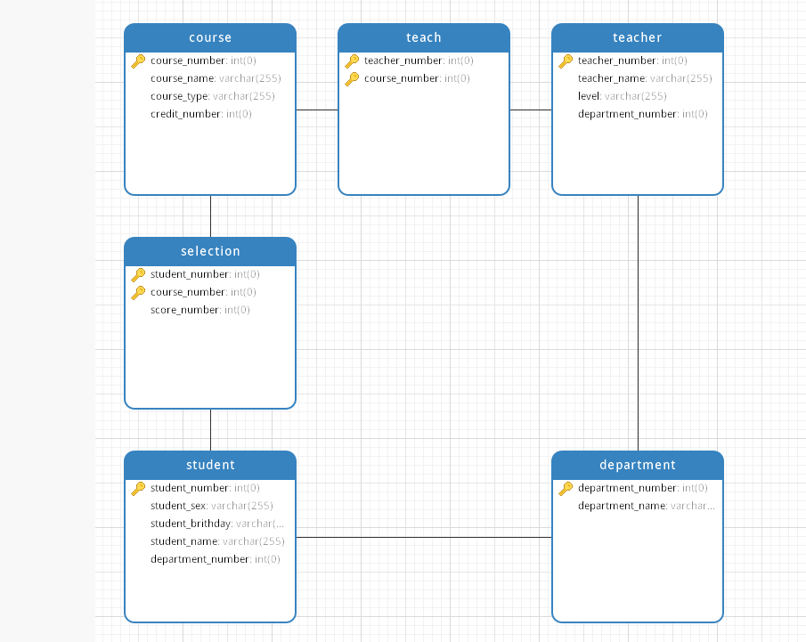
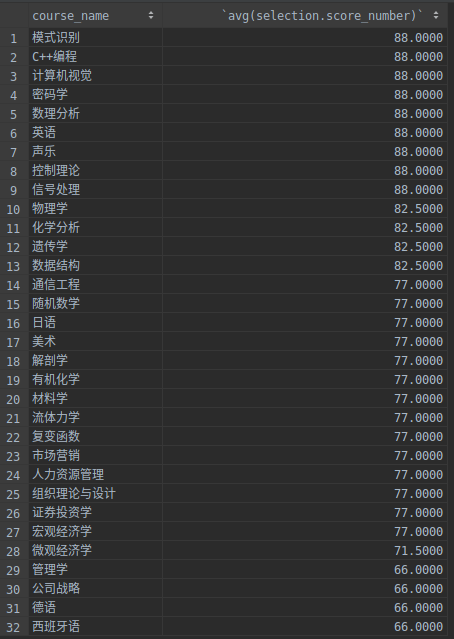

# 数据库实验三

## 1 建立ER图
根据要求, 在processOn中间, 建立图1所示


> 图1 : ER图表示概念模型

## 2 关系模式的设计
- 系(**系号**, 系名)
- 学生(**学号**，姓名，性别，出生日，*所在系号*)
- 教师(**工号**，姓名，职称，*所在系号*)
- 课程(**课程号**，课程名，课程类型，学分)
- 选课(***课程号***，***学号***，成绩)
- 授课(***课程号***，***工号***)

1. 粗体表示 primary key
2. 斜体表示 foreign key

将上述的关系模式使用navicat工具建立起来具体的table:
1. 对于每一个矩形为一个table
2. 蓝色部分为表名称
3. 白色部分为属性，其中含有钥匙图形前缀为 primary key
4. 不同矩形之间的连线表示 foreign key 的依赖关心




## 3 查询试验

1. 将navicat中的关系模式导出为mysql 建立表格语句为:
```sql
create database Student_Status;
use Student_Status;
CREATE TABLE `department` (
`department_number` int NOT NULL,
`department_name` varchar(255) NULL,
PRIMARY KEY (`department_number`)
);
CREATE TABLE `student` (
`student_number` int NOT NULL,
`student_sex` varchar(255) NULL,
`student_brithday` varchar(255) NULL,
`student_name` varchar(255) NULL,
`department_number` int NULL,
PRIMARY KEY (`student_number`)
);
CREATE TABLE `teacher` (
`teacher_number` int NOT NULL,
`teacher_name` varchar(255) NULL,
`level` varchar(255) NULL,
`department_number` int NULL,
PRIMARY KEY (`teacher_number`)
);
CREATE TABLE `course` (
`course_number` int NOT NULL,
`course_name` varchar(255) NULL,
`course_type` varchar(255) NULL,
`credit_number` int NULL,
PRIMARY KEY (`course_number`)
);
CREATE TABLE `selection` (
`student_number` int NOT NULL,
`course_number` int NOT NULL,
`score_number` int NULL,
PRIMARY KEY (`student_number`, `course_number`)
);
CREATE TABLE `teach` (
`teacher_number` int NOT NULL,
`course_number` int NOT NULL,
PRIMARY KEY (`teacher_number`, `course_number`)
);

ALTER TABLE `student` ADD CONSTRAINT `fk_student_student_1` FOREIGN KEY (`department_number`) REFERENCES `department` (`department_number`);
ALTER TABLE `teacher` ADD CONSTRAINT `fk_teacher_teacher_1` FOREIGN KEY (`department_number`) REFERENCES `department` (`department_number`);
ALTER TABLE `selection` ADD CONSTRAINT `fk_selection_selection_1` FOREIGN KEY (`student_number`) REFERENCES `student` (`student_number`);
ALTER TABLE `selection` ADD CONSTRAINT `fk_selection_selection_2` FOREIGN KEY (`course_number`) REFERENCES `course` (`course_number`);
ALTER TABLE `teach` ADD CONSTRAINT `fk_teach_teach_1` FOREIGN KEY (`teacher_number`) REFERENCES `teacher` (`teacher_number`);
ALTER TABLE `teach` ADD CONSTRAINT `fk_teach_teach_2` FOREIGN KEY (`course_number`) REFERENCES `course` (`course_number`);
```

2. 将excel 中间的导入到数据库中间


3. 查询测试

```sql
# 完成在表上的操作 (用SQL的SELECT语句)：
# 1.给出学生名，查询学生所选的所有课程名、成绩，累计学分。


(select course_name, score_number as sum_credit from student, selection, course
where student.student_number = selection.student_number and course.course_number = selection.course_number
  and student_name ='张三');

(select sum(credit_number) as sum_credit from student, selection, course
where student.student_number = selection.student_number and course.course_number = selection.course_number
  and student_name ='张三');


# 2.给出课程名，查询学生的平均成绩
select avg(selection.score_number) from course , selection where selection.course_number = course.course_number
and course_name = '模式识别';

# 3. 各门课按平均成绩排序
select course_name , avg(selection.score_number) from course , selection where selection.course_number = course.course_number
group by selection.course_number;

# 4.显示所有的课程名和讲课教师名
select course.course_name from course;
select teacher.teacher_name from teacher;
```
其结果截图为:

* **查询1**


* **查询2**


* **查询3**



* **查询4**


## 4 附录
1. [建表代码](./create.sql)
2. [查询](./query.sql)
